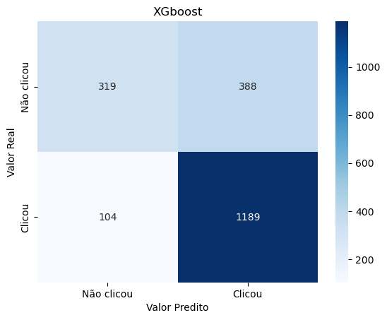

# Previsão de cliques em anúncios online

## 1. Problema de Negócio
### 1.1 Contexto
O cenário da publicidade digital é muito competitivo, e empresas gastam milhões para atrair a atenção dos usuários. No entanto, apenas uma pequena parte dessas visualizações, resulta em cliques o que torna a otimização das campanhas crucial.
Portanto o problema que buscamos resolver é: **Como prever se um usuário vai clicar em um anúncio online?**

### 1.2 Objetivo
O objetivo é construir um modelo preditivo que ajude anunciantes a direcionarem seus anúncios de forma eficaz, aumentando a taxa de conversão (número de cliques).
O modelo será capaz de prever a possibilidade de cliques com base em informações demográficas do usuário, comportamento de navegação e contexto do anúncio.

## 2. Sobre os dados
Os dados foram coletados através da plataforma Kaggle.

**Dicionário dos dados**
|nome | Descrição
|--- | ---
|id | Identificador único do usuário
|full_name| Nome do usuário formatado como "UserX" para manter anonimato
|age | Idade do usuário (entre 18 a 64 anos)
|gender | O gênero do usuário (categorizado como Male, Female, ou Non-Binary)
|device_type | O tipo de dispositivo usado pelo usuário para acessar o ad (Mobile, Desktop, Tablet).
|ad_position | A posição do ad na pagina web (Top, Side, Bottom).
|browsing_history | A atividade de navegação do usuário antes de ver o ad (Shopping, News, Entertainment, Education, Social Media).
|time_of_day | O momento do dia em que o usuário viu o ad (Morning, Afternoon, Evening, Night).
|click | O rotulo que indica que se o usuário clicou no anúncio (1 para click, 0 para não click).

## 3. Análise exploratória

Essa etapa tem como objetivo o entendimento melhor dos dados, a criação de novas variáveis, e a criação e validação de hipóteses.

### 3.1 Feature engineering
Como a variável "Age" tem uma ampla faixa etária, decidi criar outra variável chamada “Faixa etária” para ter uma visualização melhor dos dados e da relação entre si.
Também excluí do dataset a coluna 'id' que se trata apenas de um numero de identificação do usuário.

### 3.2 Análise univariada
O que mais chama a atenção nesse detaset é a quantidade de dados faltantes o que pode indicar que as pessoas estão se preocupando mais com sua privacidade.
Temos entre 20% a 47% de dados faltantes, com uma média de 33% de dados faltantes no dataset.

### 3.3 Análise bivariada
Aparentemente, adultos(entre 30 e 60 anos) parecem ter mais chance de clicar no anúncio. Porem, isso pode ser devido a maior quantidade dessa classe em nosso dataset. Proporcionalmente o número de jovens(menores de 30 anos) tem 66% de probabilidade de clique e o de adultos 64%.

## 4. Modelagem
Como dito anteriormente, temos muitos dados faltantes em nosso dataset. Fazer algum tipo de imputação seja da media, mediana, moda ou até mesmo algo mais avançado, poderia enviesar nossos dados ou até mesmo tirar uma possível característica do comportamento dos usuários, que é manter sua privacidade.
Portanto, precisamos de um algoritmo robusto que consiga lidar bem com dados faltantes. Por isso escolhi testar o XGboost e o LightGBM, já que ambos tem como característica lidar bem com dados faltantes.

## 5. Avaliação dos modelos
### 5.1 Desempenho dos modelos

## Classification Reports

### XGBoost

|              | precision | recall | f1-score | support |
|:-------------|:---------:|:------:|:--------:|--------:|
| 0            |    0.75   |  0.45  |   0.56   |     707 |
| 1            |    0.75   |  **0.92**  |   0.83   |    1293 |
| **accuracy** |           |        |          |    0.75 |
| **macro avg**|    0.75   |  0.68  |   0.69   |    2000 |
| **weighted avg** | 0.75   |  0.75  |   0.73   |    2000 |

### LightGBM

|              | precision | recall | f1-score | support |
|:-------------|:---------:|:------:|:--------:|--------:|
| 0            |    0.73   |  0.49  |   0.59   |     707 |
| 1            |    0.76   |  **0.90** |   0.83   |    1293 |
| **accuracy** |           |        |          |    0.76 |
| **macro avg**|    0.75   |  0.70  |   0.71   |    2000 |
| **weighted avg** | 0.75   |  0.76  |   0.74   |    2000 |

### 5.2 Escolha do modelo
Se olhar-mos a acurácia dos dois modelos, conseguimos ver que o LightGBM teve a maior acurácia(76%) comparado ao XGboost(75%).

Mas o objetivo do nosso modelo é prever se o usuário clicará no anúncio, ou seja, é "garantir" que não se perca cliques de usuários interessados.
Portanto, ter a menor quantidade de falsos negativos é crucial, o que se traduz em maximizar o recall.

*Sendo assim, para o nosso objetivo, o XGboost performou um pouco melhor que o LightGBM, conseguindo acertar **92%** dos usuários que clicaram no anúncio.*

## 6. Conclusão
Conseguimos assim, implementar nosso modelo e cumprir como objetivo do projeto. Com esse modelo conseguiremos direcionar melhor nossos anúncios para pessoas que realmente clicarão no anúncio, por consequencia aumentando o número de clientes da empresa.

Futuramente, podemos analisar com mais cuidado sobre s dados faltates no dataset, se são uma escolha de privacidade do usuário e caso seja, criar uma estrategia para lidar com esse público em específico.
